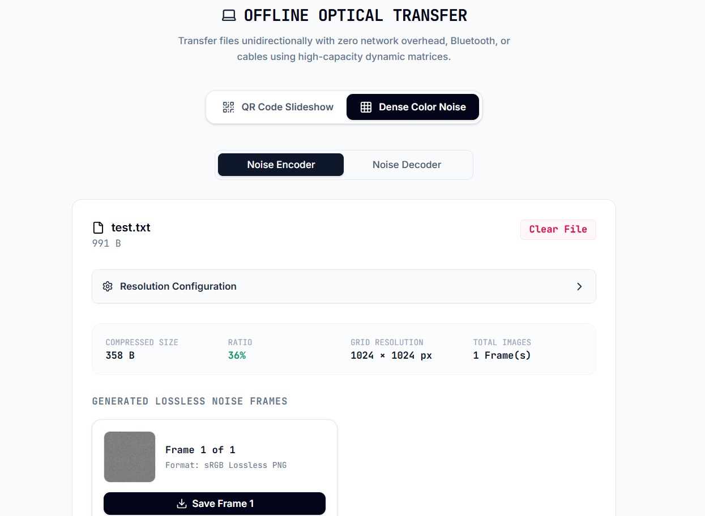

# Offline Optical File Transfer

A simple experiment in moving files using **nothing but light**.

This project transfers files completely offline using either animated QR codes or high-density color images. No internet, Bluetooth, Wi-Fi, USB, or local network required—just a screen and a camera.

## Features

-  **QR Code Transfer**
  - Automatic file compression
  - Adjustable FPS, QR size, and error correction
  - Interactive packet recovery for missed frames

-  **Color Noise Transfer**
  - Encodes raw bytes directly into RGB pixels
  - Supports files split across multiple PNGs
  - Lossless reconstruction

- **Integrity Verification**
  - SHA-256 verification after every transfer
  - Bit-perfect recovery before download

- **100% Client-side**
  - Runs entirely in the browser
  - No server, uploads, or accounts

---

## Tech

- HTML
- CSS
- JavaScript
- Web Crypto API
- CompressionStream API
- QRCode.js

---

## Screenshots

## Quick Demo

assets/demo.gif

